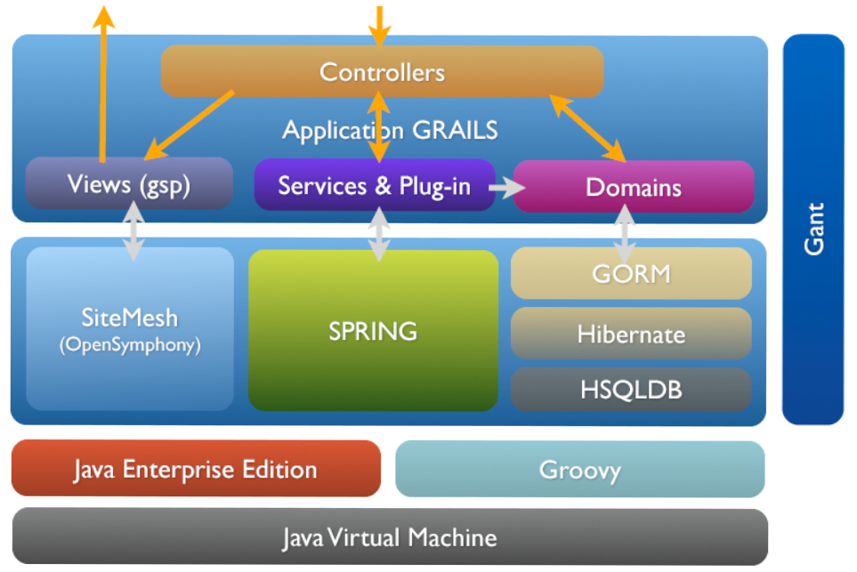

% Grails
% Adolfo Sanz De Diego
% Abril 2013

# Acerca de

## Autor

- **Adolfo Sanz De Diego**
    - Correo: [asanzdiego@gmail.com](mailto:asanzdiego@gmail.com)
    - Twitter: [@asanzdiego](http://twitter.com/asanzdiego)
    - Linkedin: [http://www.linkedin.com/in/asanzdiego](http://www.linkedin.com/in/asanzdiego)
    - Blog: [http://asanzdiego.blogspot.com.es](http://asanzdiego.blogspot.com.es)

## Licencia

- **Este obra está bajo una licencia:**
    - [Creative Commons Reconocimiento-CompartirIgual 3.0](http://creativecommons.org/licenses/by-sa/3.0/es/)

- **El código fuente de los programas están bajo una licencia:**
    - [GPL 3.0](http://www.viti.es/gnu/licenses/gpl.html)

# Introducción

## ¿Grails?

- Grails no sólo es un framework de desarrollo web,
  sino que es una **plataforma completa de desarrollo**:
    - Contenedor/servidor web
    - Gestor de base de datos
    - Scaffolding
    - Empaquetado de la aplicación (war)
    - Realización de tests (unitarios, de integración, funcionales)
    - Extensible con plugins

## Paradigmas

- Se basa en los paradigmas:
    - **CoC** (Convención sobre Configuración)
    - **DRY** (Don’t Repeat Yourself)
    - **MVC** (Modelo Vista Controlador)

## GORM

- GORM (Grails Object Relational Mapping) sirve para el **mapeo objeto-relacional**:
    - Uno a uno
    - Uno a muchos
    - Muchos a muchos

## Plugins

- Existen multitud de [plugins](http://grails.org/plugins/) que **extienden la plataforma**:
    - Seguridad
    - AJAX
    - Búsqueda
    - Informes
    - etc.

- Se pueden crear plugins **internos para funcionalidades comunes** entre varias aplicaciones.

## NIH (Not Invented Here)

 

## Arquitectura

# Instalación y configuración

## JDK

1. Descargar.
1. Instalar/Descomprimir.
1. Variable de entorno y añadir al path.

~~~{.bash}
export JAVA_HOME="~/Java/jdk"
export PATH=$PATH":"$JAVA_HOME"/bin"
~~~

## Groovy-SDK

1. Descargar.
1. Instalar/Descomprimir.
1. Variable de entorno y añadir al path.

~~~{.bash}
export GROOVY_HOME="~/Java/groovy"
export PATH=$PATH":"$GROOVY_HOME"/bin"
~~~

## Grails

1. Descargar.
1. Instalar/Descomprimir.
1. Variable de entorno y añadir al path.

~~~{.bash}
export GRAILS_HOME="~/Java/groovy"
export PATH=$PATH":"$GRAILS_HOME"/bin"
~~~

## Probando

~~~
$ grails --version
Grails version: 2.2.1
~~~

# Getting Started

## Create Grails Project

- Por línea de comandos:

~~~{.bash}
$ grails create-app my-project
~~~

- En el GGTS:

~~~
File > New > Grails Project
~~~

- Línea de comandos en el GGTS:

~~~
Control + Alt + Shift + G
~~~

## Directorios (I)

~~~
%PROJECT_HOME%
+ grails-app    -> ficheros de la aplicación grails
+ lib           -> bibliotecas
+ scripts       -> scripts
+ src
  + groovy      -> otros ficheros groovy opcionales
  + java        -> otros ficheros java opcionales
+ test          -> clases de test
+ web-app
  + css         -> archivos CSS
  + images      -> archivos de imágenes
  + js          -> archivos JavaScript
  + WEB-INF     -> otros ficheros de la aplicación web
~~~

## Directorios (II)

~~~
%PROJECT_HOME%
+ grails-app
  + conf        -> archivos de configuración
    + hibernate -> archivos de configuración de hibernate
    + spring    -> archivos de configuración de spring
  + controllers -> controladores
  + domain      -> clases de dominio
  + i18n        -> ficheros de internacionalización
  + services    -> servicios
  + taglib      -> bibliotecas de etiquetas
  + util        -> clases de utilidades
  + views       -> vistas
    + layouts   -> layouts
~~~

## Create a Domain Class

~~~{.bash}
$ grails create-domain-class org.example.Libro
~~~

~~~{.java}
package org.example

class Libro {
  String titulo
  String author

  static constraints = {
    titulo(blank: false)
    author(blank: false)
  }
}
~~~

## Create a Controller

~~~{.bash}
$ grails create-controller org.example.Libro
~~~

~~~{.java}
package org.example

class LibroController {
    def scaffold = Libro
}
~~~

## Creating Test Data

- grails-app/conf/BootStrap.groovy

~~~{.java}
import org.example.Libro
class BootStrap {
  def init = { servletContext ->
    // Check whether the test data already exists.
    if (!Libro.count()) {
      new Libro(
        author: "S. King", 
        titulo: "The Shining").save(failOnError: true)
      new Libro(
        author: "J. Patterson",
        titulo: "Along Came a Spider").save(failOnError: true)
    }
  }

  def destroy = {
  }
}
~~~

## Start Grails

~~~{.bash}
$ grails run-app
~~~

# Scaffolding

## Definición

- **Generación automática de código** para las cuatro operaciones básicas
 de cualquier aplicación (CRUD):
    - **C**reate
    - **R**ead
    - **U**pdate
    - **D**elete

## Dinámico

- En el controlador:

~~~{.java}
def scaffold = true // si se sigue la convención de nombrado
~~~

~~~{.java}
def scaffold = DomainClass // si no se sigue la convención de nombrado
~~~

## Estático

- Genera el controlador:

~~~{.java}
grails generate-controller org.example.Libro
~~~

- Genera la vista:

~~~{.java}
grails generate-views org.example.Libro
~~~

- Genera el controlador y la vista:

~~~{.java}
grails generate-all org.example.Libro
~~~

## Templates

- Podemos extraer las templates de generación de código con el siguiente comando:

~~~
grails install-templates
~~~

- Se pueden ver y modificar para su uso en la carpeta:

~~~
%PROJECT_HOME%
+ src
  + templates
    + artifacts
    + scaffolding 
    + testing
    + war
~~~

# Validación

## Clases de dominio

~~~{.java}
class User {

  String email
  String password
  Integer age
  String twitter

  static constraints = {
    email(email:true, blank:false, unique:true)
    password(size:5..15, blank:false)
    age(range:18..99)
    twitter(url:true, nullable:true)
  }
}
~~~

## Controladores

~~~{.java}
def user = new User(params)
if(user.validate()) {
  // do something with user
}
else {
  user.errors.allErrors.each {
    println it
  }
}
~~~

## Vistas

~~~{.xml}
<g:hasErrors bean="${user}">
  <ul>
    <g:eachError var="err" bean="${user}">
      <li>${err}</li>
    </g:eachError>
  </ul>
</g:hasErrors>
~~~

# CRUD

## Create

~~~{.java}
def p = new Persona(nombre: "Fred", edad: 40)
p.save()
~~~

## Read

~~~{.java}
def p = Persona.get(unaPersona.id)
assert 1 == p.id
~~~

## Update

~~~{.java}
def p = Persona.get(unaPersona.id)
p.nombre = "Bob"
p.save()
~~~

## Delete

~~~{.java}
def p = Persona.get(unaPersona.id)
p.delete()
~~~

# GORM

## Agregación (unidireccional)

~~~{.java}
class Cara {
  Nariz nariz
}

class Nariz {
  ...
}
~~~

## Agregacion (bidireccional)

~~~{.java}
class Cara {
  Nariz nariz
}

class Nariz {
  static belongsTo = [face:Face]
}
~~~

~~~{.java}
new Cara(nose:new Nariz()).save() // guarda ambos: Cara y Nariz
new Nariz(face:new Cara()).save() // da error
Face.get(faceId).delete() // borra ambos: Cara y Nariz
~~~

## Uno a uno (Foreign Key)

~~~{.java}
class Cara {
  static hasOne = [nose:Nose]

  // opcional, pero buena práctica
  static constraints = {
    nariz unique: true
  }
}
class Nariz {
  Cara cara // crea una FK en la tabla de Nariz
}
~~~

## Uno a muchos (I)

~~~{.java}
class Autor {
  static hasMany = [ libros : Libro ]
  String nombre
}
class Libro {
  String titulo
}
~~~

- Cascada al salvar y al actualizar pero no al borrar.

## Uno a muchos (II)

~~~{.java}
class Autor {
  static hasMany = [ libros : Libro ]
  String nombre
}
class Libro {
  static belongsTo = [ author: Autor ]
  String titulo
}
~~~

- Con belongsTo cascada al salvar, al actualizar y al borrar.

## Muchos a muchos

~~~{.java}
class Autor {
  static hasMany = [libros:Libro]
  String nombre
}

class Libro {
  static belongsTo = Autor
  static hasMany = [authors:Autor]
  String titulo
}
~~~

- El belongsTo marca el "propietario" de la relación, en este caso el Autor.
- Al salvar un Autor, se salvarán sus Libros, pero no al revés.
- Recomiendan usar 2 relaciones uno a muchos, mejor que una relación muchos a muchos.

# Quering

## Listados

- Todos los elementos:

~~~{.java}
def libros = Libro.list()
~~~

- Paginación:

~~~{.java}
def libros = Libro.list(offset:10, max:20)
~~~

- Ordenación

~~~{.java}
def libros = Libro.list(sort:"title", order:"asc")
~~~

## Por ID

~~~{.java}
def libro = Libro.get(23)
~~~

~~~{.java}
def libros = Libro.getAll(23, 93, 81)
~~~

## findBy y findAllBy

~~~{.java}
.find[All]By([Property][Comparator][And|Or])?[Property][Comparator]
~~~

## Comparadores (I)

- **InList** - Busca el valor dentro de la lista pasada por parámetro.
- **LessThan** - Menor que el valor pasado por parámetro.
- **LessThanEquals** - Menor o igual que el valor pasado por parámetro.
- **GreaterThan** - Mayor que el valor pasado por parámetro.
- **GreaterThanEquals** - Mayor o igual que el valor pasado por parámetro.

## Comparadores (II)

- **Like** - Equivalente al like de SQL.
- **Ilike** - Similar a Like sólo que no es sensible a las mayúsculas.
- **NotEqual** - No es igual al valor pasado por parámetro.
- **Between** - Entre dos valores (necesita dos parámetros).
- **IsNotNull** - Valor no nulo (no requiere ningún parámetro).
- **IsNull** - Valor nulo (no requiere ningún parámetro)

## Ejemplos

~~~{.java}
class Libro {
    String titulo
    Date fecha
}
~~~

~~~{.java}
def libro = Libro.findByTitulo("The Stand")
def libros = Libro.findAllByTituloLike("Harry Pot%")
libros = Libro.findAllByFechaBetween(primeraFecha, segundaFecha)
libros = Libro.findAllByFechaGreaterThan(someDate)
libros = Libro.findAllByTituloOrFechaLessThan("%titulo buscado%", fechaBuscada)
~~~

# Servicios

## Definición

- Se utilizan cuando necesitamos **transacciones**
  o cuando utilizamos varias **clases de dominio**

## Creación

~~~{.bash}
$ grails create-service org.example.Libro
~~~

~~~{.java}
package org.example

class LibroService {
    
  def doSomething() {

    // do domething
  }
}
~~~

## Transaccionalidad

- **Por defecto son transaccionales**, para deshabilitarlo:

~~~{.java}
static transactional = false
~~~

## Scope

- **Por defecto son singleton**, pero podemos usar otros scopes:
    - **prototype** - Una instancia por cada inyección.
    - **request** - Una instancia por cada request.
    - **flash** - Una instancia para la request actual y la siguiente.
    - **flow** - Una instancia por cada webflow.
    - **conversation** - Una instancia por cada conversacion de un webflow.
    - **session** - Una instancia por cada sesión.
    - **singleton** - Una única instancia (por defecto).

~~~{.java}
static scope = "flow"
~~~

## Inyección

- Los servicios se pueden inyectar en los controladores.

~~~{.java}
class LibroController {

  def libroService
  ...
}
~~~

# Configuración Log4j

## Logging levels

1. off
1. fatal
1. error
1. warn
1. info
1. debug
1. trace
1. all

## Artefactos

- conf/Config.groovy

~~~{.java}
log4j = {

    // warn a todos los artefactos de nuestra aplicacion
    warn "grails.app"
    
    // debug a un controlador específico alojado en el paquete por defecto
    debug "grails.app.controllers.YourController"

    // debug a una clase de dominio específica
    debug "grails.app.domain.org.example.Book"

    // error a todos los taglibs
    error "grails.app.taglib"
    
    // info a tos los servicios
    info "grails.app.services"
}
~~~

# Configuración Spring

## Iyección normal

- conf/spring/resources.groovy

~~~{.java}
beans = {
    rules(org.example.Rules) {
        deltaAge = 5
        deltaHeight = 0.1
    }
}
~~~

## Iyección tests

- conf/spring/resources.groovy

~~~{.java}
defineBeans {
    rules(org.example.Rules) {
        deltaAge = 5
        deltaHeight = 0.1
    }
}
~~~

# Testing

## Unit Test

- Tienen que ser rápidos, no se ejecutan en el servidor, utilizan mocks.

- Utilizan las anotaciones @TestFor y @Mock

## Integration Test

- Se ejecutan en el servidor con datos reales.

- Podemos utilizar el BootStrap para meter datos en la base de datos.

# Spring Security

## Instalación

- conf/BuildConfig.groovy

~~~{.java}
...
plugins {
  ...
  compile ':spring-security-core:1.2.7.3'
  ...
}
~~~

## Configuración

~~~
grails refresh-dependencies
~~~

~~~
grails s2-quickstart org.example User Role
~~~

## Uso

- Se usa la anotación @Secured(['ROLE_NAME']) tanto a nivel de clase como a nivel de método.

- Se pueden usar tambien las siguientes reglas:

    - **IS_AUTHENTICATED_ANONYMOUSLY**: cualquiera puede entrar, incluso sin hacer login
    - **IS_AUTHENTICATED_REMEMBERED**: sólo usuarios con login pueden entrar
    - **IS_AUTHENTICATED_FULLY**: obliga a hacer login aunque tengas la cookie de remember
